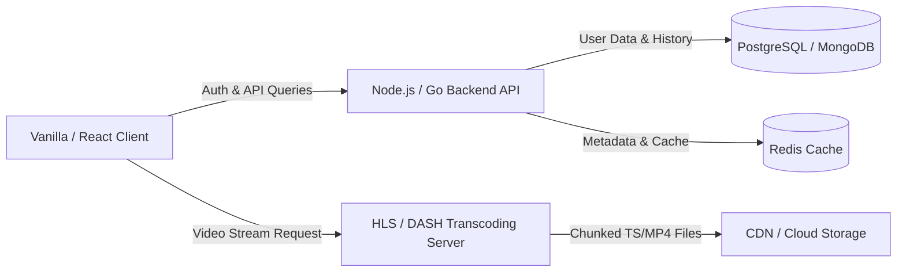

# 🍿 Netflix Web UI & Streaming Architecture Clone

<div align="center">

[](https://developer.mozilla.org/en-US/docs/Web/HTML)
[](https://developer.mozilla.org/en-US/docs/Web/CSS)
[](https://developer.mozilla.org/en-US/docs/Web/JavaScript)
[](https://developer.mozilla.org/en-US/docs/Learn/CSS/CSS_layout/Responsive_Design)
[](https://parasjain02.github.io/Netflix-Clone/)

<br>

<a href="https://parasjain02.github.io/Netflix-Clone/">
  
</a>

<p align="center">
  <b>A handcrafted, high-fidelity Netflix landing page built from scratch with zero UI frameworks.</b><br>
  Designed to master core browser fundamentals, responsive layouts, and interactive UI systems.
</p>

🔗 **Live Deployment:** [https://parasjain02.github.io/Netflix-Clone/](https://parasjain02.github.io/Netflix-Clone/)

</div>

---

## 💡 The Philosophy Behind This Project

> *"I am well aware that visual frontend clones alone don't reinvent the wheel. This project exists as a deliberate, deep-dive learning laboratory. **Every single line of HTML, CSS, and JavaScript is 100% handwritten from scratch** without component libraries, CSS frameworks (Bootstrap/Tailwind), or UI kits.*
>
> *Building this from the ground up forced me to master real-world layout mathematics, cross-browser rendering nuances, responsive multi-column wrapping, smooth accordion physics, and bespoke neon shader gradients."*

---

## 🎯 Current Implementation & Architecture

```
├── 🎬 Hero Section        → Full-bleed backdrop, multi-stop vignette gradient, language toggle & CTA
├── 🔴 Curved Dome Arch    → Precision border-radius geometry with radial glow ambient shading
├── 🍿 Trending Carousel   → Numbered rank typography (1–10), smooth programmatic scroll & touch swiping
├── 💎 Reason Cards        → Custom 3D neon gradient assets, dark glassmorphism & responsive grid
├── ❓ FAQ Accordion       → Smooth CSS max-height transitions & exclusive single-item opening logic
└── 📋 Multi-Column Footer → CSS columns engine with break-inside avoidance & responsive scaling
```

### 🧩 Detailed Feature Matrix

| Component | Technical Implementation | Highlights |
| :--- | :--- | :--- |
| **Hero & Nav** | `position: absolute`, `linear-gradient` | Seamless backdrop vignette, dropdown state, and responsive email CTA. |
| **Curved Arch** | `border-top-radius`, `radial-gradient` | Exact Netflix curved divider geometry bridging sections with ambient glow. |
| **Top 10 Carousel** | `scrollBy()`, `scrollbar-width: none` | Oversized `-webkit-text-stroke` typography + dynamic navigation buttons. |
| **More Reasons** | `flex-wrap`, custom linear angles | 4 feature cards with high-contrast 3D neon icons (`tv`, `download`, `telescope`, `kids`). |
| **FAQ Accordion** | `max-height` transition, JS event delegation | Smooth expansion animation, rotating `+` to `✕`, exclusive active state. |
| **Footer Links** | `columns: 3` + `break-inside: avoid` | 15 official links that gracefully adapt into 2 columns on mobile. |

---

## 🔭 The Future: Full-Stack & Video Streaming Roadmap

This frontend build is Phase 1. The long-term objective is evolving this repository into a **production-ready, end-to-end media streaming platform**:



- [x] **Phase 1: High-Fidelity UI Engine** — Pure semantic HTML, CSS3 layouts, and vanilla JS interactions.
- [ ] **Phase 2: Authentication & User Accounts** — JWT auth, profile switching (Kids vs Adult), and protected routes.
- [ ] **Phase 3: Media Catalog API** — REST/GraphQL service integrated with TMDB API for live movie search & dynamic categories.
- [ ] **Phase 4: Adaptive Video Streaming Pipeline** — Chunked video delivery using **HLS (HTTP Live Streaming)** or **MPEG-DASH**, video player with custom controls, bitrate switching, and playback position tracking.

---

## 🛠️ Tech Stack

<div align="center">

| Layer | Technologies Used |
| :--- | :--- |
| **Markup** | Semantic HTML5, SVG Icons, Web Accessibility (`aria-*`, `alt`) |
| **Styling** | Pure CSS3 (Flexbox, CSS Columns, Multi-stop Gradients, Media Queries) |
| **Interactivity** | Vanilla JavaScript (ES6+, DOM Traversal, Smooth Scroll API, Event Listeners) |
| **Typography** | Google Fonts (Poppins) & Netflix Hawkins Iconography |

</div>

---

## ⚡ Quick Start (Run Locally)

1. **Clone the repository:**
   ```bash
   git clone https://github.com/ParasJain02/Netflix-Clone.git
   ```

2. **Navigate to the project directory:**
   ```bash
   cd Netflix-Clone
   ```

3. **Launch the app:**
   * Open `index.html` directly in your favorite browser, or
   * Use the **Live Server** extension in VS Code.

---

## 👨‍💻 Author

**Paras Jain**
* GitHub: [@ParasJain02](https://github.com/ParasJain02)
* Live Project: [Netflix Clone](https://parasjain02.github.io/Netflix-Clone/)

---
<div align="center">
  <sub>Handcrafted with pure passion for frontend architecture and web fundamentals.</sub>
</div>

